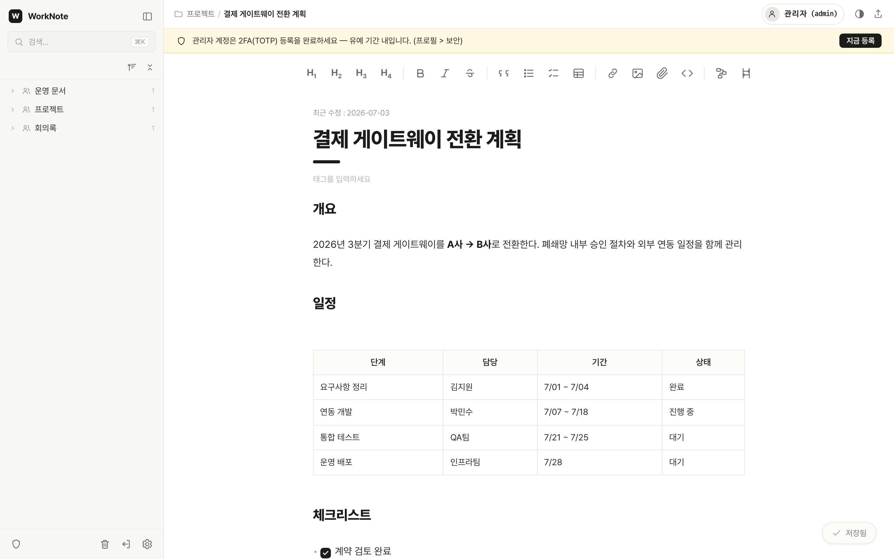
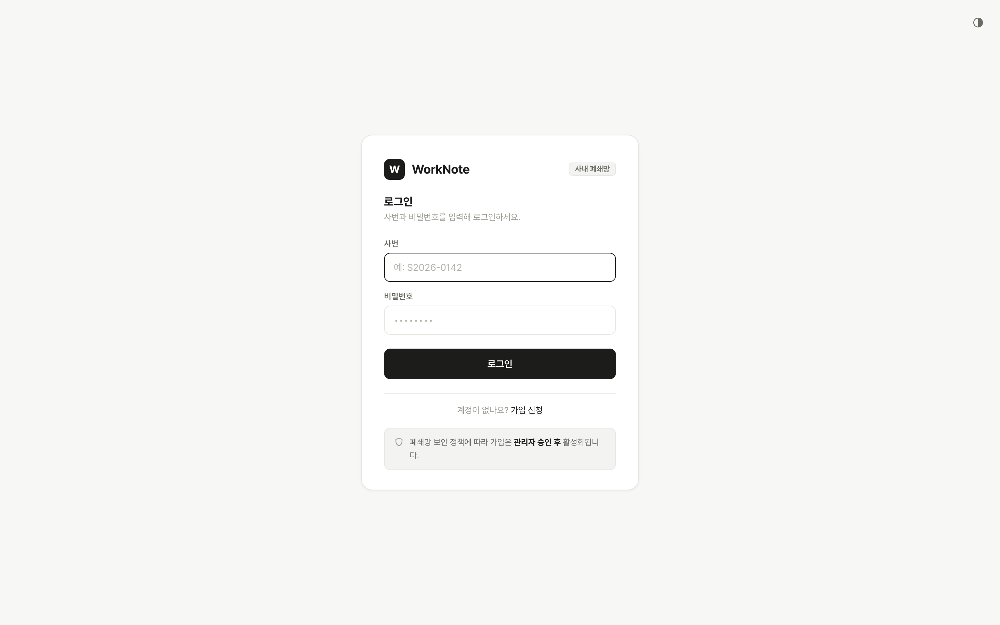
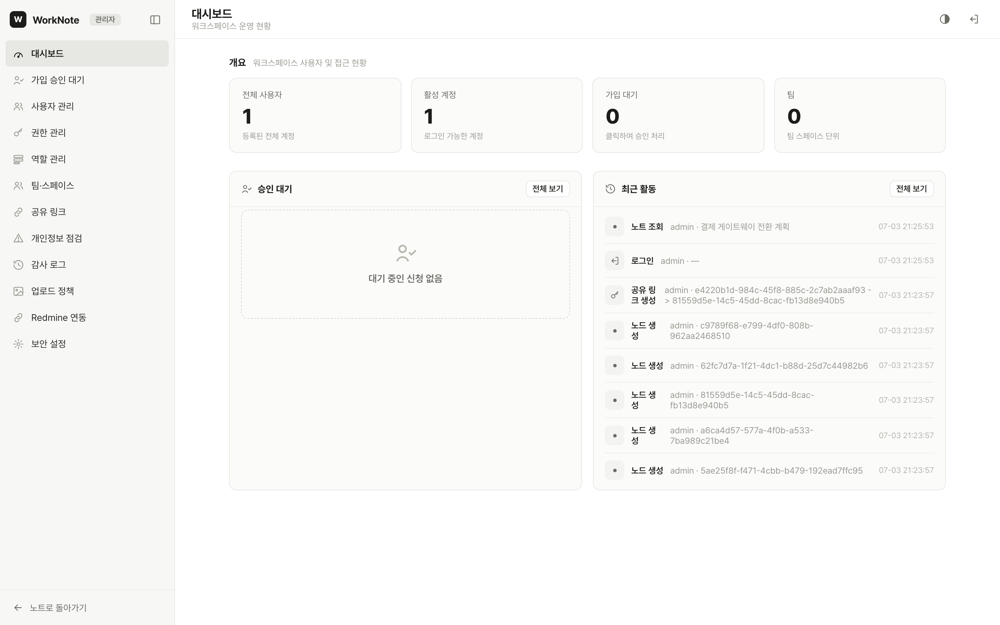
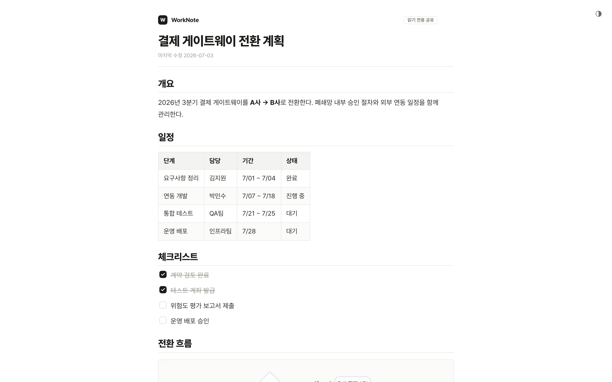

# WorkNote

폐쇄망 사내 환경을 위한 마크다운 노트 협업 도구입니다. 외부 CDN·SaaS 의존 없이 **단일 jar 하나**로 배포하며, 개인 PC에서 무인증으로 쓰는 **local 모드**와 3~4팀 규모가 함께 쓰는 **server 모드**(인증 + 권한)를 하나의 바이너리로 지원합니다.

## 화면 미리보기

**메인 에디터** — 라이브 프리뷰 마크다운, 인라인 표 편집, 체크리스트, Mermaid 다이어그램, 파일 첨부



| 로그인 · 가입 승인 | 관리자 콘솔 | 읽기 전용 공유 |
| --- | --- | --- |
|  |  |  |

## 주요 기능

- **에디터**: CodeMirror 6 기반 라이브 프리뷰(마커는 커서 줄에서만 노출), GFM 표 인라인 편집(셀 직접 입력·범위 선택·행/열 추가·정렬), 체크리스트 토글, 코드 블록 하이라이트, Mermaid 플로차트/시퀀스 다이어그램
- **문서 조직**: 폴더 트리(드래그&드롭 이동), `[[위키링크]]` 자동완성 + 백링크 패널, 전체 검색(`Ctrl/⌘+K`), 태그
- **파일 첨부**: 드래그&드롭·붙여넣기·📎 버튼 업로드, 이미지 인라인 미리보기, 관리자 정책(확장자·용량) 적용
- **권한 모델**: 역할(능력 상한) ∩ ACL(리소스 범위), deny 절대 우선, 팀 스페이스, public 캐스케이드 — 이동 시 노출 변경 사전 경고
- **공유 링크**: 만료일·최대 열람 수·대상 지정(PIN) 옵션이 있는 읽기 전용 링크. deny를 넘는 유일한 read 예외이며 전 과정이 감사 기록됨
- **보안**: 세션 인증(PBKDF2 120k iter), 가입 관리자 승인제, TOTP 2FA(관리자 유예 후 강제, 폐쇄망 오프라인 검증), 전 행위 감사 로그 + 월간 리포트, 개인정보(PII) 자동 탐지·점검 워크플로
- **휴지통**: soft-delete 후 30일 자동 영구 삭제(보존기한 설정 가능)
- **Redmine 연동**: 이슈 검색·미리보기 후 메타/본문/댓글을 노트로 삽입(사용자별 API 키, AES-256-GCM 암호화 보관)

## 두 가지 모드

| | local (기본) | server |
| --- | --- | --- |
| 대상 | 개인 PC 단독 사용 | 팀 공용 서버 |
| 인증 | 없음 | 세션 로그인 + 가입 승인제 |
| 권한 | 전체 접근 | 역할 ∩ ACL, deny 우선 |
| 2FA·감사·PII | 비활성 | 활성 |
| 전환 | `WORKNOTE_MODE` 환경변수 하나로 스위치 | |

## 빠른 시작

요구사항: **Java 21**, **Node.js + pnpm** (빌드 시)

```bash
# 1) 프런트엔드 정적 빌드 (jar에 포함됨)
cd frontend
pnpm install
pnpm build

# 2) 단일 jar 빌드
cd ../backend
./gradlew bootJar

# 3-a) local 모드 실행 (무인증, 개인용)
java -jar build/libs/worknote-0.1.0.jar

# 3-b) server 모드 실행 (인증 + 권한)
WORKNOTE_MODE=server \
WORKNOTE_ADMIN_PASSWORD='10자-이상-비밀번호' \
java -jar build/libs/worknote-0.1.0.jar
```

접속: `http://localhost:8080` — server 모드 최초 기동 시 `admin` 계정이 자동 생성됩니다. DB 경로(`WORKNOTE_DB`), 첨부 저장 경로(`WORKNOTE_UPLOAD_DIR`) 등 전체 환경변수는 [운영자 가이드](docs/operator-guide.md#환경변수)를 참고하세요.

### 개발 모드

```bash
# frontend — localStorage 모드 (백엔드 불필요)
cd frontend && pnpm dev

# frontend — HTTP 모드 (백엔드 기동 필요, /api → :8080 프록시)
VITE_STORAGE=http pnpm dev

# 테스트
cd frontend && pnpm test        # Vitest (순수 함수 유닛)
cd backend  && ./gradlew test   # JUnit (API·권한·인메모리 SQLite)
```

## 문서

| 문서 | 대상 | 내용 |
| --- | --- | --- |
| [사용자 가이드](docs/user-guide.md) | 일반 사용자 | 로그인·노트 작성·표·첨부·공유·2FA 등록·Redmine 임포트 |
| [운영자 가이드](docs/operator-guide.md) | 서버 운영자·관리자 | 설치·환경변수·권한 모델·감사 로그·백업·트러블슈팅 |
| [권한·디렉토리 설계 스펙](docs/superpowers/specs/2026-06-10-worknote-권한-디렉토리-design.md) | 개발자 | 권한 해석 규칙(deny-sticky 등) 원본 설계 문서 |

## 프로젝트 구조

```
work-note/
  frontend/     Vite 6 + TypeScript + React 18 (JSX 미사용, React.createElement 관례)
                엔트리 4개: index(에디터) / login / admin(관리자 콘솔) / share(공유 뷰어)
  backend/      Java 21 + Spring Boot 3.5 + MyBatis + Flyway + SQLite
                단일 jar 배포 — frontend dist를 classpath:/static으로 포함
  docs/         사용자·운영자 가이드, 설계 스펙, 디자인 핸드오프
```

## 기술 스택

- **Backend**: Java 21, Spring Boot 3.5, MyBatis, Flyway, SQLite(HikariCP pool=1 — 단일 라이터), ZXing(QR)
- **Frontend**: Vite 6, TypeScript, React 18(JSX 미사용), CodeMirror 6, marked + DOMPurify, Mermaid, Pretendard/D2Coding
- **저장**: 노트·메타데이터는 SQLite, 첨부 바이너리는 디스크(`WORKNOTE_UPLOAD_DIR`) — 백업은 이 둘을 함께
